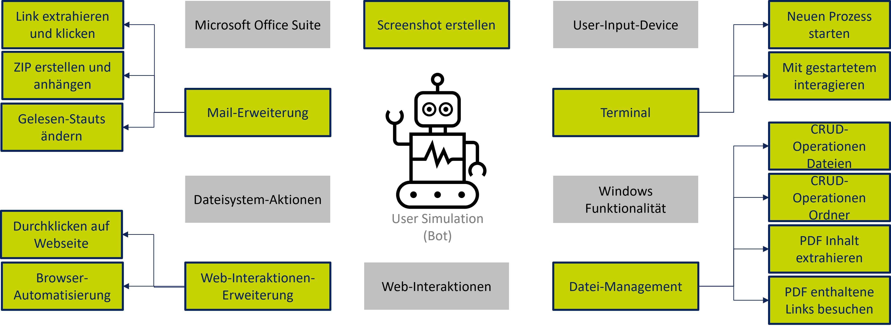

# User Simulation
Ansammlung an gewöhnlichen Nuteraktionen, zur Simulation eines Nutzer an einer normalen Workstation. Vorhandene Aktionen einsehbar [hier](#implementierte-features).

### Konfiguration
Zur Auführung von Funktionalitäten, die Selenium beinhalten, muss der jeweilige [Browser-Driver](https://www.selenium.dev/documentation/webdriver/getting_started/install_drivers/) für die passende vorhandene Version des Browsers, der gesteuert werden soll, installiert werden. Folgend müssen die Umgebungsvariablen gesetzt werden:
```
USER_SIMULATION_BROWSER_BINARY= {absoulter Pfad zur Browser Binary für Selenium}
USER_SIMULATION_DRIVER_LOCATION= {absoluter Pfad zur Driver Binary für Selenium}
```


### Verwendete Bibliotheken

- `requests` - [Docs](https://requests.readthedocs.io/en/latest/) Published under Apache 2.0 License (https://pypi.org/project/requests/)
- `BeautifulSoup` - [Docs](https://www.crummy.com/software/BeautifulSoup/bs4/doc/) Published under MIT License (https://pypi.org/project/beautifulsoup4/)
- `pywin32` - [Docs](https://mhammond.github.io/pywin32/) Published under Python Software Foundation License (PSF) (https://pypi.org/project/pywin32/)
- `PyPDF2` - [Docs](https://pypdf2.readthedocs.io/en/latest/) Published under BSD License (https://pypi.org/project/PyPDF2/)
- `selenium` - [Docs](https://pypi.org/project/selenium/) Published under Apache 2.0 License
    - needs [Browser-Driver](https://www.selenium.dev/documentation/webdriver/getting_started/install_drivers/) [siehe](#konfiguration)

# Implementierte Features

**__Template__**
**Name**: _kurze Beschreibung des Features (evtl. wie im Ticket)_

**Beschreibung**: _fachliche Beschreibung, was man mit dem implementierten Feature machen kann bzw. was man davon hat_

**Erweiterungsmöglichkeiten**: _Vorschläge für weitere Entwicklung und Verbesserung an der aktuellen Implementierung (sollten fachliche Vorschläge sein, die man in ein neues Ticket umwandeln könnte)_

---

---

### Web-Interaktionen
[Sourcecode](./src/website_walking.py)

**Name**: Durcklicken auf einer Website

**Beschreibung**: Mit dieser Funktion kann auf einer Website zufällige Links angeklickt werden. Damit wird ein Nutzer simuliert, der im Web surft.

**Erweiterungsmöglichkeiten**: Um die Funktion noch näher an das richtige Nutzerverhalten zu orientieren ist es möglich diese Schritte über Selenium abzubilden, da der Browser das Tool eines Nutzers ist, um auf Webseiten zu surfen. 

---

**Name**: Automatisierung der o.g. Funktion mit dem Web-Testing Framework Selenium

**Beschreibung**: Die o.g. Funktion wurde um die Möglichkeit der Steuerung des Browser erweitert.

**Erweiterungsmöglichkeiten**: -

---
---

### Mail-Interaktionen
[Sourcecode](./src/mail_interactions.py)

---

**Name**: Mails als gelesen markieren

**Beschreibung**: Die implementierte Funktion ermöglicht das Ändern des Gelesen-Status einer Mail von "Ungelesen" zu "Gelesen"

**Erweiterungsmöglichkeiten**: Nachdem die Klasse die Möglichkeiten bereitstellt auf Messages zu zugreifen, könnnen noch weitere Mail Interaktionen an dieser Stelle implementiert werden, wie das Sortieren oder Wiederauflegen.

---

**Name**: Eingebetteten Link in einer Mail aufrufen

**Beschreibung**: Durch diese Funktionalität können die Links aller Mails in einem Ordner extrahiert werden und im Anschluss aufgerufen werden.

**Erweiterungsmöglichkeiten**: Die implementierte Klasse bietet ein generelles Interface zu den Mails in einem Ordner, weswegen weitere Funktionalitäten recht simpel auf Basis des Zugriffs realisiert werden können. 

---

**Name**: ZIP erstellen, an Mail anhängen und Mail automatisch verschicken

**Beschreibung**: Bei alltäglichen Aufgaben von Nutzern in Unternehmen kommt es häufig vor, dass Inhalte als Anhängen in Mails verschickt werden. Darum bietet die Klasse eine Möglichkeit an ZIP-Dateien zu erstellen und diese automatisch zu versenden.

**Erweiterungsmöglichkeiten**: An dieser Stelle können noch eine ganze Reihe an anderen Funktionen beim Versenden von Mails durch das bereits vorhandenen Interface noch hinzugefügt werden.

---
---

### Datei-Management
[Sourcecode-Folder](./src/crud/)

**Name**: CRUD Operationen auf Dateien

**Beschreibung**: Die implementierte Klasse ermöglicht das Ausführen aller CRUD Operationen auf beliebigen Dateipfaden

**Erweiterungsmöglichkeiten**: Mögliche Definition und Abstraktion als Interface, sodass spezielle Implementierungen für Dateien mit nicht-Standard Dateityp entstehen, deren Handling jeweils individuell implementiert wird.

---

**Name**: CRUD Operationen auf Ordner

**Beschreibung**: Die implementierte Klasse ermöglicht das Ausführen aller CRUD Operationen auf beliebigen Ordner-Pfaden

**Erweiterungsmöglichkeiten**: Die implementierte Klasse ermöglicht das Ausführen aller CRUD Operationen auf beliebigen Ordner-Pfaden

---

**Name**: Extrahieren des Texts aus einer PDF

**Beschreibung**: Extrahieren des Texts aus einer PDF

**Erweiterungsmöglichkeiten**: Die begonnene Klasse könnte erweitert werden, sodass ebenso Metadatan zur Datei, welche nicht sichtbar codiert sind, mit ausgelesen werden.

---

**Name**: Klicken auf einen in einer PDF-Datei eingebetteten Link

**Beschreibung**: PDFs bieten die Möglichkeit direkt auf eingebettete Links zu klicken. Durch die Implementierung ist das nun programmatisch möglich diese zu extrahieren und im Browser aufzurufen.

**Erweiterungsmöglichkeiten**: Die Funktionalität kann nun mit weiteren Web-Interaktionen kombiniert werden, um komplexeres Nutzerverhalten mit mehreren Aktionene abzubilden.

---
---

### Terminal-Interaktionen
[Sourcecode](./src/backdoor.py)

**Name**: Neuen Prozess starten

**Beschreibung**: Ein beliebiges Kommando kann der Funktion übergeben werden, welche dieses dann als Deamon-Prozess ausführt.

**Erweiterungsmöglichkeiten**: Weitere Interaktion mit dem Prozess ermöglichen.

---

**Name**: Mit gestartetem Prozess interagieren

**Beschreibung**: O.g. Funktionalität wurde um die Interaktion nach dem Starten erweitert, sodass derjenige Prozess auch wieder gestoppt werden kann.

**Erweiterungsmöglichkeiten**: Nicht durch das Programm gestartete Prozesse, könnten als Erweiterung noch gemanaged werden.

---
---

### Weitere Features
[Sourcecode](./src/screenshot.py)

**Name**: Screenshot erstellen

**Beschreibung**: Screenshot eines Bildschirms machen und an angegebenem Datepfad unter Anlegung dessen ablegen.

**Erweiterungsmöglichkeiten**: Erweiterung der Parametrisierung, dass nur spezielle Ausschnitte gespeichert werden.